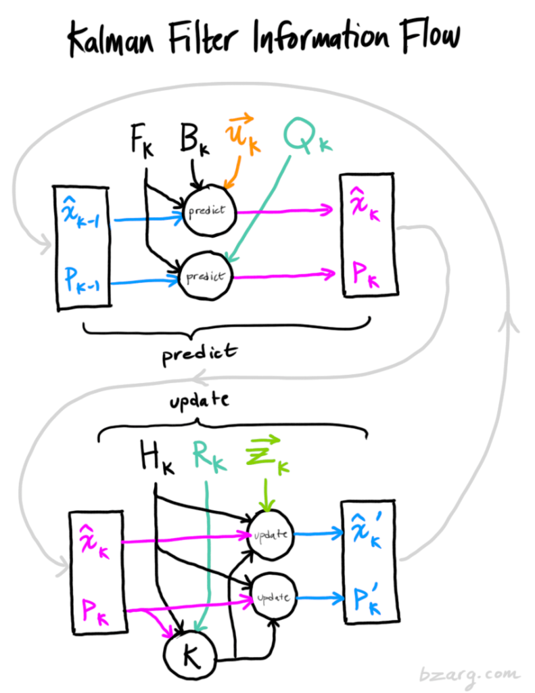

# ft_kalman — Filtre de Kalman pour Navigation Inertielle

Implémentation d'un **filtre de Kalman** en C++ pour estimer la position 3D d'un véhicule à partir de capteurs inertiels (IMU) bruités.

---

## Table des Matières

1. [Description du projet](#description-du-projet)
2. [Le problème en une image mentale](#le-problème-en-une-image-mentale)
3. [Les capteurs disponibles](#les-capteurs-disponibles)
4. [Comment fonctionne un filtre de Kalman](#comment-fonctionne-un-filtre-de-kalman)
5. [Les matrices expliquées une par une](#les-matrices-expliquées-une-par-une)
6. [Compilation et utilisation](#compilation-et-utilisation)
7. [Protocole de communication UDP](#protocole-de-communication-udp)
8. [Points techniques importants](#points-techniques-importants)
9. [Ressources](#ressources)

---

## Description du projet

Un programme externe (le « serveur IMU ») simule un véhicule qui se déplace dans un espace 3D sans gravité ni air.  
Ce véhicule possède des capteurs imparfaits : accéléromètre, gyroscope, GPS.  
Notre travail : écrire un **client** qui reçoit ces mesures bruitées, et renvoie au serveur une **estimation de la position** la plus proche possible de la réalité.

Si notre estimation s'éloigne de plus de **5 mètres** de la vraie position, ou si on met plus d'**1 seconde** à répondre, le serveur coupe la communication.

L'outil mathématique utilisé est le **filtre de Kalman** : un algorithme qui permet de fusionner intelligemment plusieurs sources d'information imparfaites pour obtenir la meilleure estimation possible.

---

## Le problème en une image mentale

Imaginez que vous conduisez les yeux fermés.  

- Toutes les **0.01 secondes**, un copilote vous dit « tu accélères de tant » (accéléromètre). Il est assez précis, mais il fait de petites erreurs.  
- Toutes les **3 secondes**, il ouvre brièvement la fenêtre et vous dit « on est à peu près là » (GPS). Il est moins précis, mais il donne une position absolue.  

Le filtre de Kalman, c'est votre cerveau : il combine les deux informations en permanence pour avoir la meilleure idée possible de « où suis-je ? ».

---

## Les capteurs disponibles

| Capteur | Ce qu'il mesure | Fréquence | Bruit (σ) |
|---|---|---|---|
| **Accéléromètre** | Accélération (ax, ay, az) en m/s² | 100 Hz (toutes les 0.01s) | σ = 10⁻³ |
| **Gyroscope** | Orientation (angles d'Euler) | 100 Hz | σ = 10⁻² |
| **GPS** | Position (x, y, z) en mètres | ~0.33 Hz (toutes les 3s) | σ = 10⁻¹ |

Le bruit est **gaussien** (courbe en cloche) centré sur 0 (moyenne μ = 0).  
En clair : les erreurs sont aléatoires, symétriques, et le plus souvent petites.

**Point important** : les accélérations et positions sont **déjà exprimées dans le repère monde** (XYZ). Le gyroscope (orientation) sert uniquement à connaître la direction du véhicule et à décomposer la vitesse initiale.

---

## Comment fonctionne un filtre de Kalman

### Le principe en deux phrases

Le filtre maintient en permanence **deux choses** :
1. **Ce qu'il pense** : une estimation de l'état (position + vitesse)
2. **À quel point il en est sûr** : une matrice de covariance (l'incertitude)

### Les deux phases, en boucle

#### Phase 1 — PRÉDICTION (à chaque pas de temps, toutes les 0.01s)

On utilise la physique pour deviner où on sera au prochain instant :

```
nouvelle_position = ancienne_position + vitesse × Δt + ½ × accélération × Δt²
nouvelle_vitesse  = ancienne_vitesse  + accélération × Δt
```

En même temps, on **augmente l'incertitude** : puisqu'on se base sur un modèle imparfait et des mesures bruitées, on est un peu moins sûr de nous à chaque prédiction.

#### Phase 2 — CORRECTION (quand un GPS arrive, toutes les 3s)

Quand le GPS donne une mesure de position, on la compare avec notre prédiction :

```
innovation = position_GPS − position_prédite
```

Puis on calcule un **gain de Kalman** (K) qui décide : « de combien je corrige ma prédiction ? ».  
Ce gain dépend du rapport entre l'incertitude de notre prédiction et l'incertitude du GPS :

- Si on est **très incertain** sur notre prédiction → K est grand → on fait davantage confiance au GPS
- Si le **GPS est très bruité** → K est petit → on garde surtout notre prédiction

Après correction, l'incertitude **diminue** : en combinant deux sources d'information, on sait mieux où on est qu'avec une seule.

### Le cycle complet

```
[Initialisation] → [Prédiction] → Envoi estimation → [Réception données]
                         ↑                                      ↓
                         ← ← ← ← ← (+ Correction si GPS) ← ← ←
```



---

## Les matrices expliquées une par une

Le filtre manipule un ensemble de matrices. Voici chacune d'entre elles, ce qu'elle représente concrètement, et comment elle est construite dans le code.

### Résumé

| Symbole | Nom | Taille | Rôle en une phrase |
|---|---|---|---|
| **x** | Vecteur d'état | 6×1 | Ce qu'on cherche à estimer (position + vitesse) |
| **F** | Transition d'état | 6×6 | Les lois de la physique (cinématique) |
| **B** | Contrôle | 6×3 | Comment l'accélération modifie l'état |
| **H** | Observation | 3×6 | Ce que le GPS peut voir (position seulement) |
| **P** | Covariance d'état | 6×6 | À quel point on est sûr de notre estimation |
| **Q** | Bruit de processus | 6×6 | Combien d'erreur les capteurs ajoutent par pas |
| **R** | Bruit de mesure | 3×3 | Combien le GPS est bruité |
| **K** | Gain de Kalman | 6×3 | Le compromis optimal prédiction ↔ GPS |

---

### x — Vecteur d'état (6×1)

C'est le cœur du filtre : tout ce qu'on cherche à connaître sur le véhicule.

```
x = [ px, py, pz, vx, vy, vz ]
      ─────────  ─────────────
      Position    Vitesse
      (mètres)    (m/s)
```

On modélise la position ET la vitesse parce que pour prédire la position future, il faut connaître la vitesse actuelle.

**Initialisation dans le code** ([Parser.cpp](src/Parser.cpp)) :
- La position initiale vient de `TRUE_POSITION` (position vraie fournie au démarrage)
- La vitesse initiale est un scalaire en km/h (`SPEED`) que l'on convertit en m/s et décompose dans les 3 axes monde via la rotation d'orientation initiale (`DIRECTION`), car le véhicule avance selon son axe longitudinal

---

### F — Matrice de transition d'état (6×6)

Encode la physique : « si je connais ma position et ma vitesse, où serai-je 0.01s plus tard ? »

```
F = | 1  0  0  dt  0   0  |       position_new = position_old + vitesse × dt
    | 0  1  0  0   dt  0  |       vitesse_new  = vitesse_old
    | 0  0  1  0   0   dt |
    | 0  0  0  1   0   0  |       dt = 0.01s (DELTA_T)
    | 0  0  0  0   1   0  |
    | 0  0  0  0   0   1  |
```

C'est une matrice identité avec des `dt` en haut à droite qui couplent la vitesse à la position.

---

### B — Matrice de contrôle (6×3)

Traduit l'accélération mesurée en modification de l'état. Elle vient des formules de cinématique :
- Δposition = ½ × a × dt²
- Δvitesse = a × dt

```
B = | dt²/2    0      0    |      ← effet sur la position
    |   0    dt²/2    0    |
    |   0      0    dt²/2  |
    |  dt      0      0    |      ← effet sur la vitesse
    |   0     dt      0    |
    |   0      0     dt    |
```

Avec dt = 0.01s : dt²/2 = 0.00005 (très petit — l'accélération change peu la position en 10ms, mais elle modifie la vitesse de façon notable).

---

### H — Matrice d'observation (3×6)

Le GPS ne mesure **que la position**, pas la vitesse. Cette matrice extrait la position du vecteur d'état complet :

```
H = | 1  0  0  0  0  0 |
    | 0  1  0  0  0  0 |
    | 0  0  1  0  0  0 |
```

Quand on fait `H × x`, on obtient `[px, py, pz]` — exactement ce que le GPS mesure.

---

### P — Matrice de covariance d'état (6×6)

Représente l'**incertitude** sur chaque composante de l'estimation.  
Les valeurs sur la diagonale sont les variances (l'écart-type au carré).

- **À la prédiction** : P **augmente** (on est moins sûr car le modèle n'est pas parfait)
  ```
  P = F × P × Fᵀ + Q
  ```
- **À la correction GPS** : P **diminue** (une nouvelle mesure réduit l'incertitude)
  ```
  P = (I − K×H) × P
  ```

Analogie : vous marchez les yeux fermés → votre incertitude sur votre position augmente à chaque pas. Vous ouvrez brièvement les yeux → vous savez mieux où vous êtes.

**Initialisation dans le code** ([KalmanFilter.cpp](src/KalmanFilter.cpp)) :  
Diagonale avec σ²_GPS pour la position et (σ²_gyro + σ²_acc × dt) pour la vitesse.

---

### Q — Matrice de bruit de processus (6×6)

Modélise l'incertitude ajoutée **à chaque prédiction** à cause du bruit des capteurs.

On la calcule via la matrice de propagation G :
```
G = | (dt²/2) × I₃ |       ← comment le bruit d'accélération affecte la position
    |    dt   × I₃ |       ← comment il affecte la vitesse

Q = G × Gᵀ × (σ²_acc + σ²_gyro)
```

Plus Q est grand → le filtre considère sa prédiction comme moins fiable → il fera davantage confiance au GPS quand celui-ci arrivera.

---

### R — Matrice de bruit de mesure (3×3)

Quantifie le bruit du GPS. Comme le bruit est le même sur les 3 axes :

```
R = σ²_GPS × I₃ = | 0.01   0     0   |
                   |  0    0.01   0   |     σ_GPS = 0.1m
                   |  0     0    0.01 |
```

---

### K — Gain de Kalman (6×3)

Calculé dynamiquement à chaque correction GPS. C'est le **cœur du filtre** : il détermine de combien on corrige la prédiction.

```
S = H × P × Hᵀ + R          (incertitude totale)
K = P × Hᵀ × S⁻¹            (gain optimal)
```

- Si P est grand (prédiction incertaine) et R petit (GPS précis) → K ≈ 1 → on suit le GPS
- Si P est petit (prédiction sûre) et R grand (GPS bruité) → K ≈ 0 → on ignore le GPS

Le filtre calcule **automatiquement** le meilleur compromis.

---

## Compilation et utilisation

### Prérequis

- Compilateur C++ (g++ ou clang++) avec support C++11
- Make

### Compiler

```bash
make        # Compile
make re     # Recompile tout
make clean  # Supprime les .o
make fclean # Supprime tout (binaire inclus)
```

Flags de compilation : `-Wall -Wextra -Werror -std=c++11`

### Lancer

**Terminal 1** — Démarrer le serveur IMU :
```bash
# macOS
./imu-sensor-stream-macos

# Linux
./imu-sensor-stream-linux

# Avec affichage du delta (écart entre estimation et réalité) :
./imu-sensor-stream-macos  --delta
```

**Terminal 2** — Démarrer le client :
```bash
./KalmanClient
```

Options utiles du serveur (`-h` pour tout voir) :
- `-s <seed>` : graine pour la trajectoire (reproductible)
- `-p <port>` : port UDP (défaut : 4242)
- `--delta` : affiche l'écart entre estimation et position réelle

---

## Protocole de communication UDP

Le dialogue entre le client et le serveur suit ce protocole :

```
Client                          Serveur (imu-sensor-stream)
  |                                |
  |──── "READY" ──────────────────>|   Déclenche la génération de trajectoire
  |                                |
  |<──── TRUE POSITION ───────────|   Position initiale vraie
  |<──── SPEED ───────────────────|   Vitesse initiale (km/h)
  |<──── ACCELERATION ────────────|   Accélération initiale
  |<──── DIRECTION ───────────────|   Orientation initiale (Euler)
  |<──── MSG_END ─────────────────|
  |                                |
  |──── "X Y Z" (estimation) ────>|   Première estimation
  |                                |
  |  ┌─── BOUCLE DE MESURES ────┐ |
  |  │                          │ |
  |<─┤── ACCELERATION ─────────┤─|   Toutes les 0.01s
  |<─┤── DIRECTION ────────────┤─|   Toutes les 0.01s
  |<─┤── POSITION (GPS) ───────┤─|   Toutes les ~3s (quand disponible)
  |<─┤── MSG_END ──────────────┤─|
  |  │                          │ |
  |──┤── "X Y Z" (estimation) ─┤>|   Réponse attendue
  |  │                          │ |
  |  └──────────────────────────┘ |
  |                                |
  |<──── "Error: ..." ────────────|   Si delta > 5m ou timeout > 1s
```

---

## Points techniques importants

### Matrices de rotation

Les rotations Rx, Ry, Rz utilisent la convention **main droite** standard :

$$R_x(\phi) = \begin{pmatrix} 1 & 0 & 0 \\ 0 & \cos\phi & -\sin\phi \\ 0 & \sin\phi & \cos\phi \end{pmatrix}$$

$$R_y(\theta) = \begin{pmatrix} \cos\theta & 0 & \sin\theta \\ 0 & 1 & 0 \\ -\sin\theta & 0 & \cos\theta \end{pmatrix}$$

$$R_z(\psi) = \begin{pmatrix} \cos\psi & -\sin\psi & 0 \\ \sin\psi & \cos\psi & 0 \\ 0 & 0 & 1 \end{pmatrix}$$

Composition : R = Rz × Ry × Rx (convention extrinsèque, appliquée dans cet ordre).

### Pourquoi ne pas utiliser uniquement le GPS ?

Le GPS n'arrive que toutes les 3 secondes. À ~60 km/h, le véhicule parcourt ~50m entre deux mesures GPS. L'accéléromètre comble ce vide en prédisant la position 300 fois entre chaque GPS.

### Pourquoi ne pas utiliser uniquement l'accéléromètre ?

Le bruit de l'accéléromètre, même faible (σ = 10⁻³), **s'accumule** :
- Erreur d'accélération → erreur de vitesse (première intégration)
- Erreur de vitesse → erreur de position (deuxième intégration)

Sans GPS pour recaler, l'erreur de position diverge quadratiquement avec le temps.

---

## Ressources

- [How a Kalman Filter works, in pictures](http://www.bzarg.com/p/how-a-kalman-filter-works-in-pictures/) — excellent tutoriel visuel
- [Kalman Filter Explained Simply](https://www.youtube.com/watch?v=mwn8xhgNpFY) — vidéo didactique
- *Kalman Filtering: Theory and Practice Using MATLAB* — Grewal & Andrews (référence académique)
